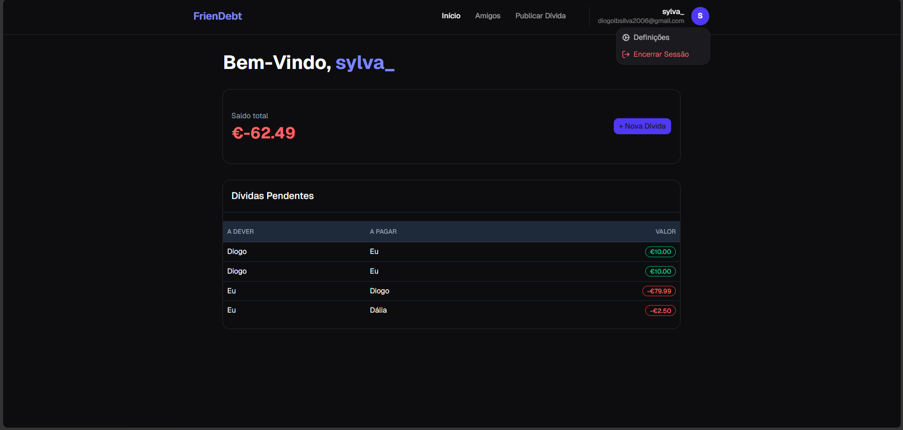
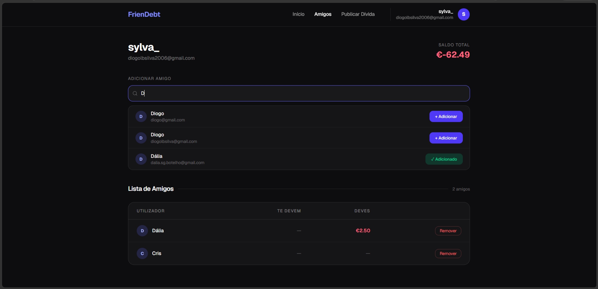
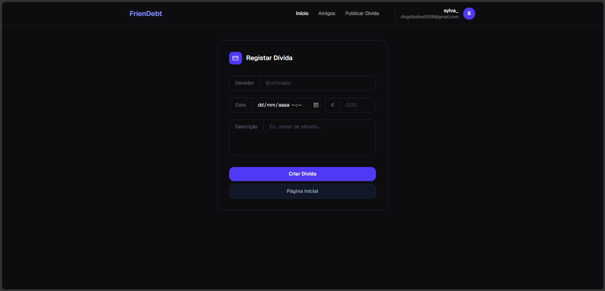
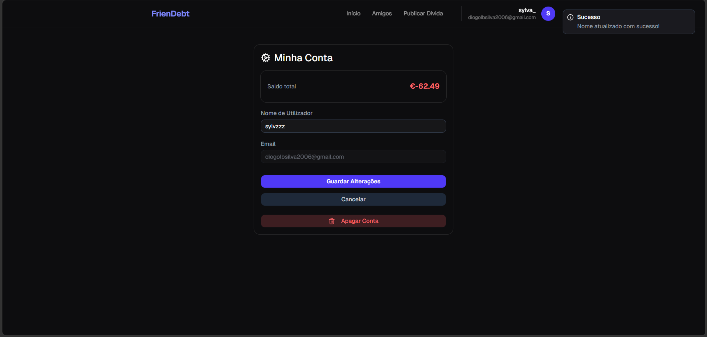

# FrienDebt | IN DEVELOPMENT

Full-stack web application designed to help groups of friends manage shared expenses. Users can add each other as friends, record who paid, who owes, and how much, with automatic balance calculations. The platform ensures transparency and simplifies settling debts so no one forgets to pay.


## Screen Captures

### Homepage


### Login


### Friends Hub


### Publish Expense


### Account Settings


---

## Functionalities

- Add friends and manage debts
- Homepage containing balance and unpaid debts.
- Navigation bar for easier navigation.
- Google OAuth login
- Automatic balance.
- Simple yet modern and clean interface resulted in combining Tailwind CSS and React.js.
- Docker containerization for smooth and error free deploy.
- Only users who add each other can insert each others debts.
- Remove friends.
- User configs.
- More in development currently...
---

## Status

🚧 In development

## Running

Usefull Docker Commands:

```bash
docker login                                          # log into Docker Hub
docker tag image_name yourusername/image_name         # rename image for Docker Hub
docker push yourusername/image_name                   # upload image to Docker Hub
```

To run the project, run:

```bash
docker login                                          # log into Docker Hub
docker pull yourusername/image_name                   # download your app image
docker pull mysql                                     # download mysql image
docker compose up                                     # start both containers
```

This will install dependencies and run the app on your machine without problems.

Other available commands:

```bash
docker run --name db-name   
-e MYSQL_ROOT_PASSWORD=root_password
-e MYSQL_DATABASE=database_name   
-e MYSQL_USER=user_name   
-e MYSQL_PASSWORD=password   
-p port:port mysql:latest | #or specify version
```

```bash
docker start mysql-container 
&&
docker exec -it mysql-container #opens a terminal for this container

mysql -u user_name -password database_name -e "SHOW TABLES;"  #executes a query

docker exec -it mysql-container-name mysql -u username -password database-name #opens a terminal client window to run queries

docker ps  #list containers running

docker container ls  #list containers

docker exec -i mysql-container mysql -u admin -p'your_password' database_name < sql_file.sql #execute .sql file

docker compose down
docker compose build --no-cache
docker compose up  #forces rebuild
```